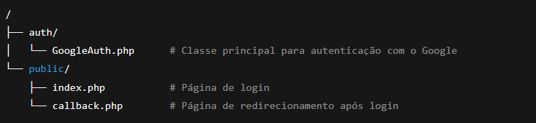

# Autenticador Google com PHP (OAuth 2.0) 🚀

Um sistema simples e funcional de autenticação utilizando Google OAuth 2.0 em PHP puro.
Com ele, você permite que usuários façam login usando suas contas do Google e recupera informações básicas como nome, e-mail e foto de perfil.

🚀 Funcionalidades

🔐 Login com Google (OAuth 2.0)

👤 Recuperação de dados do usuário (nome, e-mail e avatar)

💻 Interface simples de login

🎉 Página de boas-vindas após autenticação

🧩 Código organizado em classe (GoogleAuth) para fácil reuso

📦 Pré-requisitos

PHP 8.0+ (compatível com PHP 8.4 e 8.5)

Servidor web (Apache/Nginx) ou o built-in server do PHP

Uma conta no Google Cloud Platform para criar as credenciais OAuth

📥 Instalação
1. Clone este repositório

```shell
git clone https://github.com/seu-usuario/php-autenticacao-google-oauth2.git
```

2. Entre no diretório do projeto

```shell
cd php-autenticacao-google-oauth2
```

⚙️ Configuração

1️⃣ Crie suas credenciais no Google Cloud

1 - Acesse: https://console.cloud.google.com/apis/credentials

2 - Crie um novo projeto

3 - Vá em APIs e serviços → Credenciais

4 - Clique em Criar credenciais → ID do cliente OAuth

5 - Configure a Tela de Consentimento OAuth

6 - Selecione Aplicativo da Web

7 - Em URIs de redirecionamento autorizados, adicione:

```shell
http://localhost/authenticator/public/callback.php
```
8 - Clique em Criar

9 - Copie o Client ID e o Client Secret


2️⃣ Configure as credenciais no projeto

Abra os arquivos:

- public/index.php

- public/callback.php

E substitua:

```shell
$clientId = "SEU_CLIENT_ID";
$clientSecret = "SEU_CLIENT_SECRET";
$redirectUri = "http://localhost/authenticator/public/callback.php";

```

Garanta que o $redirectUri é idêntico ao configurado no Google Cloud.

▶️ Uso

1 - Inicie seu servidor web (Apache, Nginx ou PHP Built-in Server)

2 - Acesse no navegador:

```shell
http://localhost/authenticator/public/
```

3 - Clique em Entrar com Google

Após autenticar, você será redirecionado para a página callback e verá seus dados

📁 Estrutura do Projeto

